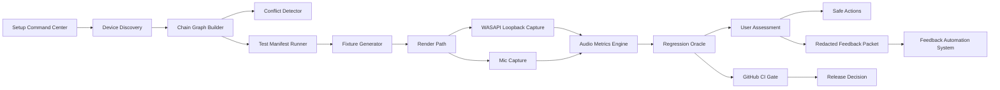

# CueForge Architecture

CueForge has two platform layers.

## Web Build

The web build is the current product surface. It is used for:

- Setup readiness checks.
- Mic and headphone testing through browser audio APIs.
- EQ generation and Equalizer APO text export.
- Hearing model, Audio DNA, Blind Match, and Tactical Masking Lab.
- Redacted player reports and replayable tester packets.

The web build should not write Windows audio settings, install drivers, or change routing.

## State Contract

CueForge v0.2.0-alpha.3 uses `cueforgeStateV2` as the shared app brain. Native engine manifests, APO exports, profile recommendations, Discord/community feedback packs, Report Lab exports, Audio DNA, and release/setup packs should all reference this same state through `src/core/cueforgeState.js` and `src/core/stateAdapters.js`.

See `docs/STATE_V2_CONTRACT.md` before adding any feature that reads setup, device, profile, readiness, or export data.

## QA Evidence Pipeline

`docs/QA_EVIDENCE_PIPELINE.md` is the release-proof map for the app. It connects real machines or canned fixtures to browser evidence, native helper manifests, evidence merge, chain graph building, route warnings, readiness v2, simulated lab harnesses, guided UI, redacted replay reports, and CI/browser/desktop replay artifacts.

Architecture work should preserve that pipeline. If a new capability changes detection, readiness, profile recommendations, lab behavior, UI assessment, report export, or desktop replay, it needs a matching proof point in that map.

## Machine Play Lab Target Architecture

Machine Play Lab is the target proof system for CueForge. It should stay local-first and Windows-first because the product is currently built around WASAPI-style endpoint evidence, Equalizer APO, PowerShell scanner reports, Electron desktop bridging, and future native verification. The native layer should expand toward measurement and verification first, then selective safe writes only after the proof loop is stable.

Owner rule:

- Device Discovery, Chain Graph Builder, and Conflict Detector must stay read-only.
- Test Manifest Runner and Fixture Generator own reproducible scenarios before live capture.
- WASAPI loopback and Mic Capture are measurement inputs, not hidden apply paths.
- Audio Metrics Engine and Regression Oracle decide whether a change actually improved a fixture or user packet.
- Safe Actions can only suggest or stage explicit user-reviewed changes.
- Redacted Feedback Packet is the only artifact that leaves the local machine by default.
- GitHub CI Gate blocks release decisions when manifests, fixtures, UI, redaction, desktop smoke, or replay proof fail.

## Repository Layout Contract

The current app still ships from the working Vite/React entry in `src/main.jsx`, but new feature work should land behind the v0.2.0 foundation folders so the project stays understandable as it grows.

- `src/app/routes` is for page-level app surfaces and route wrappers.
- `src/app/components` and `src/app/hooks` are for shared React pieces once a screen graduates out of `src/main.jsx`.
- `src/features` is the product-facing migration target for Setup Command Center, Auto Detect, Self Test, Blind Match, Hearing, Report Lab, Player Trial, and Machine Play Lab UI.
- `src/shared` is for cross-feature schemas, privacy, audio, and state adapters.
- `src/core/chain` owns the player audio-chain graph, route warnings, evidence packets, and readiness inference adapters.
- `src/core/scoring` owns readiness and confidence scoring.
- `src/core/manifests` owns native engine manifest validation and schema contracts.
- `src/core/exports` owns report/export pack policy and privacy checks.
- `src/detection/browser` owns browser-safe audio/device collection.
- `src/detection/native` owns desktop bridge merge and companion-layer detection.
- `src/detection/heuristics` owns route-risk checks such as double EQ, wrong default devices, and chat/game split risk.
- `src/lab/harness`, `src/lab/generators`, and `src/lab/fixtures` own repeatable offline test material.
- `src/native/electron` and `src/native/helper` are reserved for the desktop bridge and future helper contracts.
- `src/tests` mirrors the same layers for unit, integration, visual, desktop, fixture, and contract tests.
- Root `native/windows` owns future Windows bridge, WASAPI harness, probes, and APO lanes.
- Root `qa` owns Playwright, Electron, audio fixtures, manifests, analyzers, baselines, reports, and hardware-profile scenarios.
- Root `swarm` owns persona routes, jobs, and repair queues.
- Root `tools/ffmpeg` and `tools/scripts` own local helper tooling.
- `docs/architecture`, `docs/qa`, and `docs/release` keep long-lived docs out of the app bundle.

Existing proven modules can stay where they are until they are safely split. New folders should use adapter exports instead of duplicating logic. The full extraction plan is tracked in `docs/architecture/REPO_LAYOUT.md`.

### Hardware Profile Manifests

Hardware profiles live in `qa/hardware-profiles/*.json` and use `cueforge.hardware-profile.v1`. They describe explicit player-chain expectations without raw device IDs:

- Input/output device kinds and match hints.
- Companion tools marked `expected`, `optional`, or `forbidden`.
- Expectations for communications endpoint split, loopback proof, manual route verification, and max round-trip latency.

`src/shared/schemas/hardwareProfile.js` validates those manifests and can assess browser/native evidence against a profile. Auto Detect and VM lab work should use profile assessments rather than ad hoc string checks when simulating common Windows player setups.

### Lab Manifests

Lab manifests live in `qa/audio/manifests/*.json` and use `cueforge.lab-manifest.v1`. They describe exactly what a Machine Play Lab run should execute for a known hardware profile:

- Device scan and route graph checks.
- Latency or loopback proof requests.
- EQ/audio regression fixtures.
- Mic pipeline checks.
- Electron/browser onboarding.
- Privacy/redaction gates.

`src/shared/schemas/labManifest.js` validates those run descriptions and turns them into `cueforge.lab-run-plan.v1` packets. The run plan maps each test type to the responsible runner while keeping the hard safety gate: no raw audio export by default, device IDs and user paths redacted, and `systemMutationAllowed: false`.

The supported lab classes are part of that contract, not just comments:

- Immediate: unit, integration, end-to-end, A/B audio render, chain-graph verification, conflict detection, latency regression, and mic pipeline tests.
- Next: blind-match automation, hearing-model automation, and bit-exact DSP regression.

`qa/audio/manifests/machine-play-lab-full-coverage.json` proves every class is represented. Older manifest names such as `chain-graph`, `latency`, and `audio-regression` stay accepted as aliases so existing smoke runs keep working while new manifests use clearer class names.

### Swarm Manifests

Swarm manifests live in `swarm/routes`, `swarm/jobs`, and `swarm/repair`. They make the human-swarm idea reproducible instead of hidden:

- Route manifests define the entry surface, required selectors, expected state transitions, native API expectations, fixtures, analyzer thresholds, privacy constraints, failure owner, safe auto-repair actions, and escalation level.
- Job manifests define daily smoke, nightly audio regression, and release-candidate runs with fixed seeds, route coverage, output artifacts, and hard gates against system mutation or public posting.
- Repair manifests define which Panda Notes or route-regression findings can become narrow copy/layout/fixture fixes and which actions are always blocked.

The validator is `src/shared/schemas/swarmManifest.js`, and the release proof is `npm.cmd run validate:swarm`. A swarm run may create local reports and reviewed repair tickets; it must not post publicly, change Windows audio state, write APO configs, install drivers, upload raw audio, or store private account data.

## Open-Source Stack Contract

`src/data/openSourceStack.js` is the product-facing source of truth for open-source integration choices. It records each tool's tier, CueForge role, integration path, proof gates, guardrails, and source link.

The contract keeps library use honest:

- Use now: Equalizer APO, AutoEq, and Playwright.
- Browser DSP core: OfflineAudioContext and AudioWorklet.
- Next native stage: NAudio, miniaudio, and RNNoise.
- Differentiated tier: Steam Audio only for game/middleware spatial research, not post-mix enemy-location claims.

Any new library should enter this registry before it becomes app behavior. If the library can touch native audio, mic processing, spatial claims, or player privacy, it needs proof gates and guardrails before UI integration.

## Security And Privacy Gate

`src/securityPrivacyGate.js` is the release-blocking security contract. It checks local-first defaults, redacted exports, hashed device/route fingerprints, summary-only evidence packets, protected playback boundaries, driver-layer boundaries, Electron hardening, native helper capabilities, and the non-medical hearing disclaimer.

`src/core/evidencePrivacyPolicy.js` is the shared evidence policy. Report Lab, Audio Evidence, native capture planning, and export gates should use the same defaults: raw audio stays local, uploads are opt-in only, public packets use summaries and derived metrics, usernames and raw IDs are redacted, and protected playback capture is not promised as universal.

Export correlation uses `src/exportFingerprints.js`. Reports and setup packs can include `cfp_...` fingerprints so repeated setup issues can be matched without exposing raw device IDs, group IDs, labels, local paths, emails, or phone numbers.

Electron hardening is centralized in `src/security/electronPolicy.js` and consumed by `electron/main.mjs`. The desktop shell keeps renderer sandboxing, context isolation, node integration off, IPC sender validation, restrictive CSP, HTTPS-only external links, and local-only app navigation.

## CueForge Brain

`src/core/cueforgeBrain.js` turns the shared state into the product proof layer: audio chain verification, personal sound identity, conflict doctor, game intent, safe export/apply, local evidence, and native-engine readiness.

This is the differentiator:

- Not just EQ preset packs.
- Not magic enemy-location AI.
- Not hidden driver or routing changes.
- Proof-first, preference-aware, game-intent-aware, local-first tuning.

`buildCueForgeState()` returns `brain`, and `buildCueForgeReleasePack()` includes `cueforge-brain.json` so a release packet can show why a setup is or is not ready. Any future feature that claims to improve CueForge should either improve one of these brain pillars or remain outside the main flow.

## Guided Command Center

The main app flow starts at the Setup Command Center instead of separate labs. The command center summary is built in `src/core/commandCenterFlow.js` and rendered by `src/ui/SetupCommandCenter.jsx`.

The flow order is:

Start -> Setup Command Center -> Auto Detect -> Chain Graph -> Conflict Fix -> Output Check -> Mic Check -> Hearing Model -> Choose Game / Genre -> Blind Match -> Masking Lab -> Profile Recommendation -> Engine Preview -> Export / Apply -> Player Trial -> Report / Audio DNA.

The home screen must always show these six cards:

- Setup Health
- Active Profile
- Audio Chain
- Next Best Action
- Last Match Feedback
- Export / Apply Status

Those cards should be derived from readiness, profile, chain graph, conflicts, apply path, and saved tester evidence. Do not hard-code separate status copy in multiple screens.

## Auto Detect v2

Auto Detect now creates a normalized report in `src/core/autoDetectReport.js` before the UI shows setup guidance. That report separates browser devices from Windows bridge devices, scores companion layers, strips raw IDs/paths, and produces player-facing Detected / Risk / Recommended copy.

The report must stay safe to export:

- Browser inputs and outputs are normalized from `navigator.mediaDevices`.
- Windows render/capture devices are normalized from the desktop bridge JSON.
- Companion apps are reported as confidence-scored booleans for Equalizer APO, Peace, Sonar, Voicemeeter, VB-CABLE, Dolby/DTS, Windows Sonic, Nahimic, and Razer THX.
- Risks and recommendations must explain routing uncertainty instead of pretending the browser can silently fix Windows.

Chain Graph, readiness, setup intelligence, release packs, and the future desktop/native setup flow should consume this normalized shape instead of scraping raw scan fields.

### Layered Evidence Assessment

`src/detection/assessMachine.ts` is the high-level entry point for the new detection pattern:

Browser evidence is fast and local, but permission-gated. Native evidence is stronger when present because it can include Windows endpoints, app sessions, defaults, and installed companion tools. The assessment flow is:

1. Normalize browser evidence: Web Audio support, mic API, permission state, and exposed input/output devices.
2. Convert native evidence into the bridge report shape without leaking raw endpoint IDs.
3. Build the Chain Graph from merged evidence.
4. Infer route warnings and conflict health.
5. Infer readiness from the same graph and warnings.
6. Return one packet with `graph`, `rawGraph`, `warnings`, `readiness`, `autoDetect`, `evidence`, and `confidence`.

This keeps Auto Detect from being simple label matching. The source of truth becomes layered evidence: browser hints first, desktop bridge proof when available, explicit confidence always.

### Chain Graph v3

`src/core/chain/evidenceGraph.ts` is the graph-first layer. It stops treating detection as a product checklist and materializes the audio chain as nodes and edges:

- Node kinds: app session, game app, communication app, virtual mixer, system effect, APO layer, physical output, and physical input.
- Edge relations: routes-to, processed-by, defaults-to, and mirrors.
- Native endpoints become higher-confidence route nodes.
- Browser devices become lower-confidence corroboration nodes that can mirror native endpoints when labels line up.
- Installed tools such as Equalizer APO, Peace, Sonar, Voicemeeter, VB-CABLE, Dolby, DTS, Windows Sonic, Nahimic, Razer THX, FxSound, NVIDIA Broadcast, and Voicemod become processor nodes.
- Windows defaults and per-app sessions become route edges without exposing raw endpoint IDs.

The live app graph in `src/core/chainGraph.js` follows the same contract for the current React surfaces and release exports. It now models physical input/output endpoints, browser mic/app capture hints, Discord/communication app processing, Sonar/Voicemeeter/VB-CABLE virtual routes, Equalizer APO attachment, Windows default multimedia endpoints, Windows default communications endpoints, and app-session hints from the desktop bridge scan.

The graph can now catch topology problems like missing physical endpoints, missing mic input, multiple virtual mixers, multiple spatial/effect layers, and the important Sonar -> APO -> physical DAC stack that can mean double processing or an APO target mismatch.

## Simulated Audio Harness

`src/lab/harness/runMaskingFixture.ts` is the deterministic browser/CI masking harness. It renders a repeatable footstep-plus-masker scene, slices the rendered audio into analyzer input, applies the expected EQ delta, and proves the analyzer result does not get worse.

The harness has two render paths:

- Browser path: uses `OfflineAudioContext` when it exists, so the audio graph can render faster than real time without touching hardware.
- CI/Node path: uses the deterministic JS renderer with seeded signal generators, so tests can run without audio devices.

The result includes `before`, `after`, `improved`, `delta`, frame metadata, renderer type, sample rate, and scenario. This is the regression-test foundation before the future AudioWorklet/native DSP path. AudioWorklet remains the right next browser step when CueForge needs steadier low-latency custom processing, but the regression harness should stay offline and deterministic.

## Audio Metrics Engine

`src/engine/audioMetricsEngine.js` is the shared proof layer for clips, fixtures, and future native captures. It keeps metrics split into four buckets:

- Chain integrity: signal present, not muted, not mostly silence, and no obvious flattened/double-processing hint.
- Loudness / dynamics: RMS, peak, crest factor, clipping risk, preamp headroom, and loudness proxy until FFmpeg/libebur128 reference output is wired in.
- Spectral / EQ behavior: FFT band energy, cue-vs-mask balance, and before/after spectral deltas.
- Spatial / stereo health: correlation, mono collapse, polarity inversion, channel balance, and latency skew.

The FFmpeg reference plan maps to `astats`, `silencedetect`, `ebur128`, `aphasemeter`, and `axcorrelate`, but the committed engine also has deterministic JS fallbacks so CI can prove behavior without a local FFmpeg install. Native capture and local clip import should feed this engine before a recommendation reaches the Regression Oracle.

The minimum A/B regression policy is `eq-render-a-b`: fixture `cue_steps_reference.wav`, WASAPI loopback from the active default render endpoint, integrated loudness delta within +/-1.0 LUFS of baseline, phase average greater than 0.95, cue-band gain increase between +1.5 dB and +3.0 dB, no DC offset warning, and no clipping event. It fails immediately if the output device changes mid-test, the communications endpoint hijacks the render path, or a double-processing signature appears.

Evidence privacy remains part of the metrics contract: public packets keep derived metrics and recommendations, not raw audio, private usernames, local paths, or whole machine dumps.

## This Or That Preference Model

Sound Match is now the player-facing layer for preference learning. The standard flow uses nine hidden A/B rounds: seven preference axes plus two reversed repeat checks. Players can also mark a round as too close so CueForge does not force fake certainty into the model.

Those answers produce a hidden model in `src/core/preferenceModel.js` with bounded weights for footstep priority, voice clarity, bass impact, masking control, cue boost, voice separation, spatial width, center focus, detail, comfort, treble, bass, and fatigue risk. The saved model lives in `cueforgeStateV2.calibration.preferenceModel` and can also be attached to the Sound Match result.

`src/blindMatch.js` keeps the legacy module name for compatibility, but the exported result schema is `cueforge.sound-match-result.v2`. Result confidence now depends on completed rounds, neutral choices, hidden repeat consistency, and contradiction count. Five-round runs stay preview-only; the standard 9-round pass is required before direct apply readiness.

The profile engine consumes that model before export/apply recommendations. It adjusts EQ, dynamics, and spatial planning together instead of treating Sound Match as a separate lab. Any future tuning feature that learns user preference should update this same model or translate into this shape before reaching `src/core/profileEngine.js`.

## Personalization Lab Inputs

`src/core/personalizationLabInputs.js` turns Hearing Model, Sound Match / Blind Match, Masking Lab, and Player Trial results into one formal lab contract under `cueforgeStateV2.calibration.labInputs`.

The contract keeps the product honest:

- Hearing data is safe self-calibration and preference weighting, not medical audiometry.
- Playback must be quiet, amplitude-capped, and click-to-play.
- Repeated threshold checks can lower confidence and force a retest.
- Sound Match, Masking Lab, and Player Trial each receive capped influence weights.
- The profile engine can learn from player choices without letting one shaky test overdrive EQ or treble.

This is the product path for personal clarity without wrecking comfort: repeated safe tests, consistency checks, conservative weights, real match proof, and no medical language.

## Windows Desktop Shell

A desktop shell is the correct next layer when CueForge needs native control. The desktop app can wrap the existing React UI and add a small native bridge for:

- Reading Windows audio endpoints with stable device names.
- Detecting Equalizer APO, Peace, Sonar, FxSound/OEM enhancers, Dolby/DTS/THX spatial layers, mic processors, and active routing.
- Saving reviewed Equalizer APO draft files after explicit approval.
- Backing up existing configs before any future target-file write.
- Running setup checks without browser permission friction.

Current path: Electron with a locked-down preload bridge. The desktop bridge can run the existing Windows audio scanner from inside CueForge, store the report in the app data folder, return the parsed result to Auto Detect and Setup Intelligence, save timestamped APO draft files, and open the relevant app-data folders.

Future native writes to real Equalizer APO or Windows locations should stay behind the same bridge and must be reviewed separately.

## Native DSP Manifest

CueForge now exports a reviewable native DSP manifest from `src/engines/nativeEngineManifest.js`. This is the bridge between the React state brain and any later native engine.

The manifest includes:

- `sampleRate: 48000`, `blockSizeTarget: 128`, and stereo channel assumptions.
- A deterministic processing module list: preamp, parametric EQ, limiter placeholder, dynamics placeholder, and spatial placeholder.
- A mic plan from `src/engines/micPlan.js` covering input gain checks, noise-floor estimates, clip risk, voice presence, Discord-safe suggestions, and the future RNNoise adapter.
- A spatial plan from `src/engines/spatialPlan.js` with honest modes: Safe Stereo, Competitive Width, Immersive HRTF Preview, and a future Developer Spatial SDK lane.
- Safety caps: `maxBoostDb: 6`, `maxHearingBoostDb: 3`, required limiter, clipping guard, and calculated negative preamp.
- Prototype backend guidance for miniaudio.

The manifest is a plan, not an apply command. It does not capture system audio, install a driver, change Windows routing, or write Equalizer APO configs by itself.

The post-v0.2 native roadmap is tracked in `src/data/nativeEngineRoadmap.js` and `docs/NATIVE_ENGINE_ROADMAP.md`. The intended order is:

1. v0.3.0 Native DSP Sandbox: miniaudio prototype, PEQ, limiter, test WAV rendering, latency experiments, and manifest import.
2. v0.4.0 Desktop Real-Time Preview: local A/B preview through the app with no driver install.
3. v0.5.0 Windows User-Mode Engine Path: APO-like or service-backed adapter research, signing, installer hardening, backup, and rollback.
4. v0.6.0 Mic Enhancement Pack: RNNoise adapter, Discord-safe mic profiles, and streamer mode.
5. v0.7.0 Spatial Research Pack: libmysofa HRTF loader, Steam Audio research sandbox, and honest immersive experiments.
6. v1.0.0 Signed Public Beta: signed, trusted, local-first desktop release backed by real player testing.

## Native Helper Manifest

The desktop helper has its own versioned manifest contract, separate from the DSP engine plan:

- Validator: `src/core/manifests/validateNativeEngineManifest.ts`
- JSON schema: `src/native/helper/manifest-schema.json`
- Manifest version: `cueforge.native.v1`

The helper manifest describes what the desktop bridge can safely observe or write today:

- Windows OS family/build.
- Endpoints with name, role, transport, supported sample rates, channel counts, and default roles.
- Detected helper tools: Equalizer APO, Peace, Sonar, Voicemeeter, and VB-CABLE.
- Capabilities: read defaults, read sessions, read loopback, write APO drafts, and the hard safety value `canModifySystemState: false`.

React should trust this manifest contract over ad hoc helper fields. A helper that claims it can modify system state is invalid by schema. That keeps the current native surface honest: desktop info, scan/read report, and save APO draft are allowed; silent routing changes, driver installs, and system modification are not.

## Audio Safety Rules

CueForge keeps shared safety limits in `src/core/safetyRules.js` so hearing tests, profile recommendations, APO export, and the native manifest all use the same contract.

Current rules:

- Max total boost: +6 dB.
- Max hearing-model boost: +3 dB.
- Max treble boost: +2 dB.
- Required preamp headroom: 1 dB beyond the highest boost.
- Limiter ceiling: -1 dB.
- Loud tones must never autoplay; test tones require an explicit click.
- Hearing warnings stay visible.

Player-facing warning copy:

- Keep your volume low during hearing tests.
- CueForge will prefer cuts and safe headroom over aggressive boosts.

### Mic Engine Plan

CueForge v0.2.0 keeps mic work metrics-first. The app can show mic status, noise floor, clip risk, voice presence, and a recommended next action from local browser or desktop-bridge data. It must not apply hidden gain, silently enable suppression, upload raw voice audio, or change Discord/Windows input routing.

RNNoise is the planned optional native cleanup adapter because it is BSD-3-Clause and purpose-built for noise suppression. It stays disabled in the v0.2.0 manifest and should only become active later through an explicit desktop/native flow with a clear warning and player approval.

### Spatial Honesty

CueForge can improve the final audio chain, but true object-level occlusion and scene-aware spatial audio require game-engine support. The app must not claim it can recover true source position, wall occlusion, room geometry, or object metadata from a normal mixed stereo output.

Steam Audio is useful research because it is Apache-2.0 licensed, supports Windows, Linux, macOS, Android, and iOS, and integrates with Unity, Unreal, FMOD, and Wwise. In CueForge, it belongs in the future SDK/game-partner lane unless the game exposes metadata or an integration path.

The player-facing modes are:

- Safe Stereo: no fake surround, best for competitive clarity.
- Competitive Width: slight crossfeed and controlled width without exaggerated virtual surround.
- Immersive HRTF Preview: optional for story, horror, RPG, and racing, not promised as true scene occlusion.
- Developer Spatial SDK: future hooks for engines or partner builds.

### miniaudio Prototype Lane

miniaudio is the preferred first native lab helper because it is compact enough to embed and broad enough to cover playback, capture, full-duplex tests, device enumeration, WASAPI loopback measurement, offline rendering, and an internal node graph. CueForge should use it first for:

- Offline audio test rendering.
- Explicit WASAPI loopback measurement on Windows.
- Explicit mic capture measurement.
- Tone generation.
- DSP validation.
- Latency experiments.
- Device enumeration experiments.
- Native bridge proof-of-concept work.

Do not ship miniaudio as the system-wide CueForge engine yet. Keep it behind explicit experiments until the app proves the manifest, safety rules, and tester demand.

`src/native/harness/nativeCaptureHarness.js` is the current contract for that lane. It defines the miniaudio-first backend plan, PortAudio/RtAudio fallback candidates, allowed harness modes, and request validation. Live modes require a player action, short bounded windows, local raw buffers by default, and `canModifySystemState: false`. The harness may measure and render; it may not install drivers, change default devices, change routing, or write APO configs.

WASAPI loopback proof can be constrained by Windows DRM or protected playback paths. CueForge should report that boundary plainly and fall back to offline fixtures, local A/B checks, or explicit player evidence instead of claiming universal capture.

## Setup Assessment Snapshot

CueForge now publishes a local `cueforge.setup-assessment-snapshot.v1` contract after the state bundle is built. This is the small, stable object that the UI, lab runner, desktop bridge, and future integrations can read without needing to know the whole React app.

The snapshot is written three ways:

- `localStorage["cueforge:setup-assessment:snapshot"]`
- `window.cueforgeSetupAssessment`
- `cueforge:setup-assessment` browser event

It contains readiness, a chain summary, conflict summary, CueForge Brain proof, export status, and a state anchor. It does not include raw audio, raw device IDs, raw Windows paths, or account data. The implementation lives in `src/core/setupAssessmentSnapshot.js`, and `src/core/cueforgeState.js` includes `cueforge-setup-assessment.json` in the release pack.

## Companion Repo Integration

CueForge borrows patterns from the companion repos without giving them unsafe power:

- Autobot pattern: run read-only scheduled maintenance for notes repair, route graph lab, audio fixture regression, and feedback contract checks.
- Kalshi Scout pattern: keep deployment/readiness smoke strict for build freshness, first-window desktop launch, bridge API shape, and exported packet schemas.
- Feedback Automation pattern: ingest only redacted tester packets, cluster issues, draft work, and keep source edits behind approval.
- Crypto Intelligence pattern: publish the versioned local snapshot contract so UI, lab runners, and future integrations can read one shared assessment object.

The tested map lives in `src/data/companionRepoIntegration.js`. The guardrail is simple: companion patterns may orchestrate proof and triage, but they must not post publicly, change Windows audio state, write APO configs, upload raw audio, or handle private account data.

## Release Tool Backlog

`src/data/releaseToolBacklog.js` ranks the candidate tools and engines behind the roadmap:

- Required: WASAPI loopback, FFmpeg/libebur128, and Playwright.
- Primary native engine: miniaudio.
- Fallback/benchmark candidates: PortAudio and RtAudio.
- Optional mic module: RNNoise.
- Optional Chromium probe layer: Puppeteer, never primary.
- Scene-lab spatial research: Steam Audio, never arbitrary-game post-mix magic.

The backlog is release-stage based so the team can see which tool belongs to v0.2 hardening, v0.3 native sandbox, v0.4 desktop preview, v0.6 mic enhancement, or v0.7 spatial research. Every candidate has proof gates, blocked uses, and an official source URL.

## Native Action Rules

Every native action should follow the same pattern:

1. Show exactly what will change.
2. Require an explicit user click.
3. Create a backup when writing files.
4. Apply the change.
5. Show the result and how to undo it.

No silent installs. No hidden routing changes. No background driver edits.

## Open Questions And Limitations

CueForge is Windows-first on purpose right now. The current design, docs, and native path are centered on WASAPI, APOs, Equalizer APO, PowerShell scanning, and the Electron desktop bridge. If the project later needs macOS or Linux parity, the harness abstraction should leave room for Core Audio and PipeWire/ALSA backends, but that is not the shortest path to a trustworthy next Windows release.

Public visibility can lag the local lab. When writing public reports, treat the visible GitHub files as the authoritative baseline. Local QA stacks, `qa:preflight`, `notes:repair`, swarm routes, and repair reports are only externally proven after the matching files are pushed. Comments about local-only checks are useful direction, not a substitute for inspectable source.

Spatial truth stays bounded. CueForge can become a strong final-chain optimizer, verifier, and personalized assessment system. It can use Steam Audio or similar tools for synthetic lab scenes and future engine/middleware integrations. It must not market arbitrary-game post-mix processing as equivalent to engine-native propagation, object-level occlusion, map geometry, or exact enemy positions.
