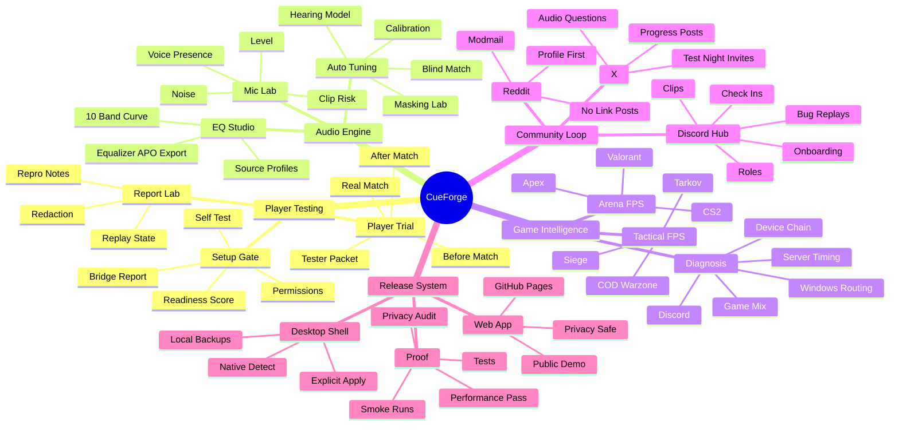

# CueForge Master Plan

Last updated: May 22, 2026.

CueForge is building toward one clear promise: make FPS audio testing repeatable. Players should be able to test a setup, play a real match, export useful evidence, and know whether the issue is CueForge tuning, the game mix, the server, Discord, Windows routing, mic gain, or the headset/IEM chain.

## Master Map



## Workstream 1 - Player Testing

Goal: make a tester's first 10 minutes useful.

### Setup Gate

Purpose: catch obvious blockers before someone plays a match.

Breakdown:

```text
Mic permission state
Browser audio support
Audio device visibility
Optional Windows bridge report
Equalizer APO / Peace / Sonar / Voicemeeter / VB-CABLE status
Readiness score
Next recommended action
```

Ready standard:

```text
Tester can run the gate without help.
Blocked permission states explain exactly what to do.
The app never asks for raw private data.
The redacted setup summary is copy/paste ready.
```

### Player Trial

Purpose: stop one-line feedback like "sounds good" from being the main data.

Breakdown:

```text
Before-match baseline
Game and mode
Gear chain
Footstep rating
Direction rating
Comms rating
Comfort/fatigue rating
What improved
What got worse
Tester packet export
```

Ready standard:

```text
One match produces a useful before/after packet.
The packet can be posted in Discord or GitHub without leaking private IDs.
```

### Report Lab

Purpose: make bugs replayable.

Breakdown:

```text
Redacted report export
Report import
EQ state replay
Game/source/mic state replay
Self-test snapshot
Bug notes
Privacy strip
```

Ready standard:

```text
A broken tester flow can be imported and reproduced locally.
Reports strip raw device IDs, paths, emails, phone numbers, and full user-agent strings.
```

## Workstream 2 - Audio Engine

Goal: give players tuning that is personal, explainable, and exportable.

### Mic Lab

Breakdown:

```text
Live input meter
Voice presence
Noise estimate
Clip risk
HyperX-style guidance
Discord-ready advice
```

Ready standard:

```text
Mic feedback moves live when permission is granted.
No mic data is uploaded by default.
Tester sees what to change before blaming the app.
```

### EQ Studio

Breakdown:

```text
10-band editing
Preamp
Source profiles
Game focus
Equalizer APO export
Local config save
```

Ready standard:

```text
Export text matches the visible EQ curve.
The app explains that users must explicitly apply exported configs.
```

### Auto Tuning

Breakdown:

```text
Calibration wizard
Blind Match preference learning
Masking Lab anti-masking curves
Personal Hearing Model
Audio DNA snapshot
```

Ready standard:

```text
Auto tuning produces a curve, explains why, and can be applied to EQ Studio.
No feature claims medical accuracy.
```

## Workstream 3 - Game Intelligence

Goal: never assume every audio problem is an EQ problem.

### Game Families

Tactical FPS:

```text
Escape from Tarkov
Rainbow Six Siege
Call of Duty / Warzone
```

Arena and competitive FPS:

```text
Apex Legends
CS2
Valorant
Battlefield-style large mix games
```

### Diagnosis Split

Every serious report should ask which bucket fits:

```text
CueForge tuning
Game mix or audio engine
Server/desync/timing
Windows routing
Discord processing
Mic gain/noise chain
IEM/headset physical fit
User hearing/fatigue
```

Ready standard:

```text
The app and Discord templates push players to diagnose the cause, not just complain that "audio is bad."
```

## Workstream 4 - Community Loop

Goal: turn public attention into useful feedback without spam.

### Discord Hub

Current status:

```text
Community Server enabled
Onboarding ON
Chiefyy / chiefbabyy has Chiefyy Forge Queen with Administrator
Bamboo Mod has moderation tools without Administrator
Read-only resource pages verified
Default onboarding channels configured
Starter tasks configured
```

Primary rooms:

```text
#start-here - first stop
#rules - safety and privacy rules
#lab-updates - progress, roll calls, release notes
#signal-setups - full gear/audio chain
#match-checkins - before/after match feedback
#bug-replays - reproducible problems
#clip-evidence - proof clips and timestamps
#bamboo-lounge - casual community
```

### Reddit

Safe mode:

```text
Profile-first
No repeated removed posts
No mass link drops
Ask mods first in game communities
Comment helpfully before sharing links
Disclose CueForge ownership every time
```

### X

Safe mode:

```text
2-4 tags per post
Rare @mentions
Progress, questions, or test night invites
No spammy official account tagging
```

## Workstream 5 - Release System

Goal: ship public builds that are easy to test and hard to misuse.

### Web Release

Breakdown:

```text
GitHub Pages public build
Browser-safe mic and playback testing
Privacy-safe report export
No silent driver/routing changes
```

### Desktop Shell

Breakdown:

```text
Native audio scan
One-click local bridge report
Explicit Equalizer APO helper flow
Backups before writes
No hidden driver installs
```

### Proof Gate

Required before wider public push:

```text
npm test
npm run build
npm audit --audit-level=moderate
Local smoke test
Privacy/redaction spot check
Discord onboarding check
Reddit-safe outreach check
```

## Release Timeline

### Alpha 1 - Public Testable Core

Date target: May 22-26, 2026.

Ship:

```text
Setup Gate
Self Test
Auto Detect setup summary
Mic Lab
EQ Studio export
Player Trial
Report Lab
Discord onboarding
Master Plan
```

Success:

```text
5 real testers complete one match check-in.
At least 3 different gear chains are reported.
At least 1 bug report can be imported and replayed.
```

### Alpha 2 - Evidence And Diagnosis

Date target: May 27-June 2, 2026.

Ship:

```text
More diagnosis prompts
Game-family report tags
Cleaner tester packets
First Discord test night
First mod-approved Reddit post
```

Success:

```text
10 real tester packets.
3 clips or replay notes.
Clear split between tuning, game mix, Discord, and Windows routing issues.
```

### Beta 1 - Player Ready

Date target: June 3-14, 2026.

Ship:

```text
Desktop shell pass
Native bridge polish
Performance mode validation
Better onboarding screenshots
Release checklist hardening
```

Success:

```text
25 active testers.
No known private-data leaks in reports.
No critical app crashes in first-run flow.
```

### Beta 2 - Wider Community

Date target: June 15-30, 2026.

Ship:

```text
Polished docs site
Game-specific testing pages
Discord bot commands
Weekly update rhythm
Contributor guide
```

Success:

```text
50 active testers.
Repeatable feedback from at least 5 FPS games.
At least 10 imported/replayed reports.
```

### Public 1.0 Candidate

Date target: July 1-15, 2026.

Ship:

```text
Public release notes
Stable privacy policy
Desktop shell decision
Verified setup guide
Known limitations list
```

Success:

```text
A new player can install/open, test, export, and report without direct help.
Known browser/native boundaries are clear.
No critical privacy, performance, or first-run bugs remain.
```

## First Public Update

Use this as the first Discord/X/profile update after the plan is published.

```text
CueForge update 001:

The Panda Lab is no longer just a pile of channels. Discord onboarding is live, the first tester path is mapped, and the master roadmap is public.

What is ready to test:
- Setup Gate and Self Test
- live mic feedback
- Auto Detect setup summaries
- IEM/headset EQ export
- Player Trial before/after match packets
- redacted Report Lab bug replays

What I need next:
- IEM users
- headset users
- HyperX/USB mic users
- Equalizer APO / Peace / Sonar users
- Tarkov, Siege, COD/Warzone, Apex, CS2, Valorant players

Run one real match. Tell me what helped, what got worse, and whether the problem felt like tuning, the game, Discord, Windows routing, or the mic chain.

App: https://p4nd4907.github.io/cueforge/
Discord: https://discord.gg/vyQwyJ49v
GitHub: https://github.com/P4ND4907/cueforge
```

Recommended images:

```text
assets/discord/progress/cueforge-setup-gate.png -> #lab-updates
assets/discord/progress/cueforge-beta-checkin.png -> #match-checkins
assets/discord/progress/cueforge-report-lab.png -> #bug-replays
assets/discord/progress/cueforge-gameplay-save.png -> #lab-updates
assets/discord/cueforge-social-card.png -> X/profile posts
```
