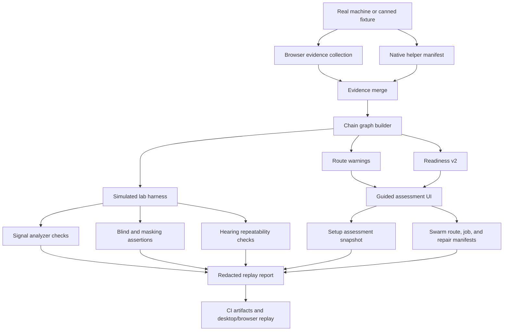
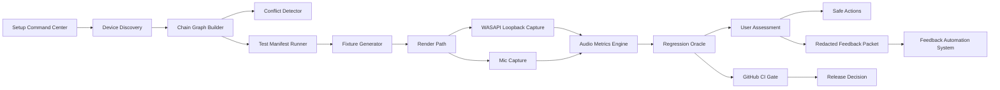

# CueForge QA Evidence Pipeline

This is the official release-proof map for CueForge. It describes how a real machine, canned fixture, browser build, desktop shell, lab harness, UI, report export, and CI artifacts all connect.



## Contract

Every release candidate should prove the same loop:

1. Collect local browser evidence and optional native helper evidence.
2. Merge evidence into one chain graph.
3. Derive route warnings, readiness, and confidence from that graph.
4. Run deterministic lab harness checks for signal, Blind Match, masking, and hearing behavior.
5. Surface the result in the guided UI with one best next action.
6. Publish a local setup-assessment snapshot for UI/lab/future integration consumers.
7. Export only redacted replay data.
8. Save CI artifacts/screenshots so failures can be reproduced later.

## Implementation Map

| Pipeline step | Owner | Proof command |
| --- | --- | --- |
| Browser evidence collection | `src/detection/browser/*`, `src/core/autoDetectReport.js` | `npm.cmd run validate:fixtures` |
| Native helper manifest | `src/native/helper/manifest-schema.json`, `src/core/manifests/*` | `npm.cmd run validate:manifest` |
| Evidence merge | `src/detection/assessMachine.ts`, `src/core/chain/evidence.ts` | `npm.cmd run validate:fixtures` |
| Chain graph builder | `src/core/chainGraph.js`, `src/core/chain/evidenceGraph.ts` | `npm.cmd run validate:fixtures` |
| Route warnings | `src/core/conflictDetector.js`, `src/detection/heuristics/*` | `npm.cmd run validate:fixtures` |
| Readiness v2 | `src/core/readinessScore.js`, `src/core/scoring/readinessV2.ts` | `npm.cmd run test:ui` |
| Simulated lab harness | `src/lab/harness/*`, `src/lab/generators/*` | `npm.cmd run test:harness` |
| Signal analyzer checks | `src/signalAnalyzer.js` | `npm.cmd run test:harness` |
| Audio Metrics Engine | `src/engine/audioMetricsEngine.js` | `npm.cmd run test:harness` |
| Blind and masking assertions | `src/blindMatch.js`, `src/maskingLab.js` | `npm.cmd test` |
| Hearing repeatability checks | `src/core/hearingModelV2.js`, `src/hearingModel.js` | `npm.cmd test` |
| Guided assessment UI | `src/ui/SetupCommandCenter.jsx`, `src/main.jsx` | `npm.cmd run test:ui` and `npm.cmd run screenshots:update -- --if-needed` |
| Setup assessment snapshot | `src/core/setupAssessmentSnapshot.js`, `src/data/companionRepoIntegration.js` | `npm.cmd run validate:manifest` |
| Swarm route/job/repair manifests | `swarm/routes/*`, `swarm/jobs/*`, `swarm/repair/*` | `npm.cmd run validate:swarm` |
| Redacted replay report | `src/reportPack.js`, `src/exportPack.js`, `src/privacyAudit.js` | `npm.cmd run export:redaction-check` |
| CI artifacts and replay | `.github/workflows/release-gate.yml`, `tools/Run-*.mjs` | `powershell -ExecutionPolicy Bypass -File .\tools\run-checks.ps1` |

## Acceptance Rule

If a bug can bypass this pipeline, the pipeline needs a new fixture, screenshot gate, desktop replay, or redaction check before the release is called ready.

## Machine Play Lab Target

Machine Play Lab is the Windows-first version of this proof loop. It turns CueForge from a web/audio workbench into a repeatable local machine lab: discover the device chain, build a graph, run deterministic manifests, capture only with explicit local permission, measure the result, compare it against an oracle, then decide whether a release or recommendation is safe.



Build order:

1. Manifest-driven Test Runner: run canned browser/bridge/hardware scenarios without touching Windows state.
2. Fixture Generator: create deterministic footsteps, comms, pink noise, rumble, clipping, and masking scenes.
3. Render Path: offline first, then browser AudioWorklet preview, then native sandbox rendering.
4. WASAPI Loopback Capture: desktop-only measurement path for rendered endpoint proof.
5. Mic Capture: opt-in local measurement for noise, clipping, voice presence, and Discord-safe guidance.
6. Audio Metrics Engine: shared metric output for chain integrity, loudness/dynamics, spectral/EQ behavior, spatial/stereo health, before/after deltas, and confidence.
7. Regression Oracle: compare before/after results and reject changes that are louder but not clearer.
8. User Assessment: show one next action and explain the reason.
9. Safe Actions: stage export/apply recommendations only after proof, backup, and explicit user approval.
10. CI Gate: every new lab claim needs fixtures, redaction checks, UI proof, and desktop smoke before release.

Swarm manifests are the checked-in version of the human tester routes. They describe the surfaces, selectors, transitions, fixtures, thresholds, repair owners, and safe repair boundaries that a randomized or persona-based QA run must follow. They can create local reports and repair tickets; they cannot post publicly, change Windows audio state, write APO configs, or upload raw audio.

Native bridge boundary:

```text
Measure first.
Verify second.
Suggest third.
Stage reviewed writes later.
Never silently change routing, drivers, APO targets, Discord settings, or Windows defaults.
```

## Open Questions And Limits

Some upstream comparison data is still incomplete. Autobot and kalshi-scout influenced this proof system through the surfaced workflows, scripts, docs, and CI patterns that were available locally, but CueForge should not assume it has a complete private-repo inventory unless that tree is explicitly checked again.

The "Machine Play Lab" idea is now the target architecture name for CueForge's local proof system. It is still built from existing virtual machine player lab, harness, fixture, and desktop/browser replay modules, so the next implementation step is giving it a real owner folder, command, and test report.

The product boundary also stays important: CueForge can become very strong at chain diagnosis, route-risk detection, personalization, replayability, and post-mix enhancement. It should not claim true object-level occlusion, reflection, or scene-aware spatial awareness from a normal mixed stereo output. That level of spatial truth depends on geometry-aware game or middleware integration because the missing information lives upstream in the game/audio engine.

The right split is:

- Self-contained tier: make chain verification, personalization, warnings, safe export/apply, and replay reports excellent without requiring game hooks.
- Native/helper tier: add safer Windows evidence, desktop replay, local DSP preview, and explicit apply workflows.
- Integration tier: future engine or middleware hooks for titles that can expose richer spatial metadata.

The shortest path to a stronger next release is still the same four-step foundation: refactor the monolith, formalize the manifest and chain graph, build fixture-driven harness tests, and keep visual/desktop CI as a release blocker.
